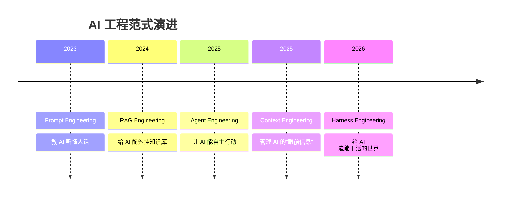
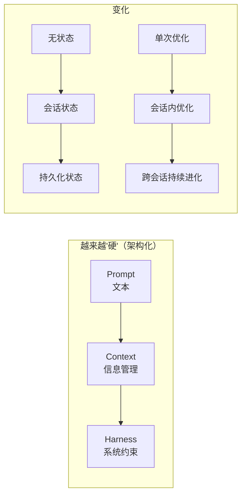

## AI 工程范式演进全景图

从 2023 年到 2026 年，AI 工程领域经历了多个范式的演进。以下按时间线完整总结：



## 完整范式对比表

| 范式 | 核心问题 | 通俗理解 | 关键人物/事件 | 时间 |
|------|---------|---------|--------------|------|
| **Prompt Engineering** | "这句话怎么说 AI 才懂？" | 教 AI 听懂人话 | 早期 GPT-3 用户 | 2023 |
| **RAG Engineering** | "怎么让 AI 查自己的资料库？" | 给 AI 配外挂知识库 | 向量数据库爆发 | 2024 |
| **Agent Engineering** | "怎么让 AI 自己动手做事？" | 让 AI 能自主行动 | ReAct, AutoGPT | 2025 |
| **Context Engineering** | "这次该给 AI 看什么信息？" | 管理 AI 的"眼前信息" | 上下文窗口大战 | 2025 |
| **Harness Engineering** | "怎么约束 AI 让它可靠干活？" | 给 AI 造能干活的世界 | Mitchell Hashimoto | 2026 |


### 早期（2023）：基础的 Context Engineering
那时候模型上下文窗口只有 4K-8K tokens，对话稍微长一点就爆了。

当时说的 "context management" 指的是：
- 怎么截断消息
- 怎么滑动窗口
- 怎么保留 system prompt

狭义的 Context Engineering 早于 Agent Engineering。

### 晚期（2025）：高级的 Context Engineering
窗口已经扩大到 128K-1M tokens，装得下但模型"找不到"重要信息。

这时候说的 Context Engineering 指的是：
- RAG 检索
- 信息重排序
- 上下文压缩
- 状态管理

这晚于 Agent Engineering——因为 Agent 跑起来后才发现"能装进去但模型不认"这个新问题。

## 各范式详细说明

### 1. Prompt Engineering（提示工程）— 2023

```javascript
// 核心实践
"写一个贪吃蛇"  → ❌ 输出不完整
"用 HTML/CSS/JS 写一个贪吃蛇游戏，Canvas 800x800，20x20网格，键盘控制..." → ✅ 输出完整
```

**关键点**：Few-shot、Chain-of-Thought、角色扮演、格式约束

### 2. RAG Engineering（检索增强生成）— 2024

```javascript
// 核心实践
用户提问 → 向量检索 → 找到相关文档 → 注入上下文 → 生成回答

// 解决：模型知识过时、幻觉、私有数据访问
```

**关键点**：向量数据库（Pinecone、Milvus）、Embedding、重排序

### 3. Agent Engineering（智能体工程）— 2025

```javascript
// 核心实践
while (任务未完成) {
    思考(thought) → 行动(action) → 观察(observation)
}

// 代表：ReAct、AutoGPT、LangGraph
```

**关键点**：工具调用、循环控制、多步规划

### 4. Context Engineering（上下文工程）— 2025

```javascript
// 核心实践
// 在有限窗口内，放最有效的信息
上下文 = 压缩(历史) + 检索(知识库) + 状态(会话) + 约束(规则)
```

**关键点**：滑动窗口、摘要压缩、状态维护、RAG 增强

### 5. Harness Engineering（驾驭工程）— 2026

```javascript
// 核心实践
// 每个错误 → 架构级修复 → 永不重犯
Agent = 模型 + Harness(编排层 + 记忆层 + 执行层 + 反馈层)
```

**关键点**：任务拆解、规则固化、验证闭环、循环检测、跨会话持久化

## 演进本质：从"软"到"硬"



| 维度 | Prompt | Context | Harness |
|------|--------|---------|---------|
| **形式** | 文本字符串 | 信息检索系统 | 完整工程架构 |
| **状态** | 无状态 | 会话级 | 持久化、跨会话 |
| **纠错** | 下次注意 | 这次记住 | 永远不可能再犯 |
| **时间跨度** | 单次交换 | 单次会话 | 长时间、多轮 |

## 一句话记忆

> **2023 问"怎么说"，2024 问"查什么"，2025 问"做什么"和"看什么"，2026 问"怎么让它可靠地做"。**

